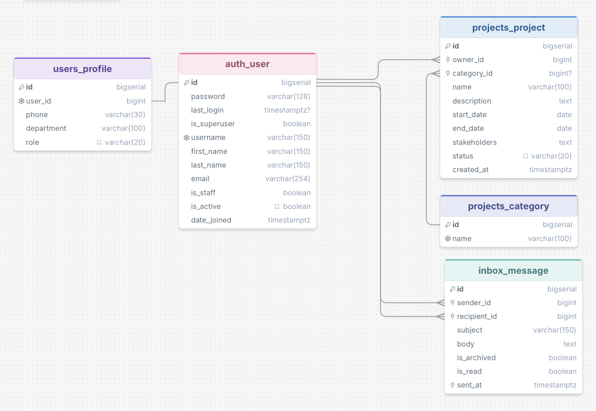

# ProjectPilot
## Project Description
ProjectPilot is a Djando-based project management web application designed to help individuals and teams organise projects, maintain project information and communicated through an internal messaging system. 

Users cn register an account, maintain a personal profile, create and categorise projects, exhange messages with other users and monitor activity through a central dashboard. 

The project demonstrates core Django ideas including:
- PostgreSQL database integration
- Django models and migrations
- Authentication and password hashing
- Role-based authorization
- Function-based and class-based views
- CRUD operations 
- Django forms and validation
- Template inheritance
- Responsive Bootstrap styling and layout
- JavaScript form behaviour
- Email-based password recovery mechanism
- Automated testing with Django 'TestCase'

## Features

### User registration and authentication
Users can register with a username, email address and password. Passwords are securely hashed using Django's built-in authentication system rather than being stored as plain text. Users can log in and out, while protected views redirect unauthenticated visitors to the login page. 

### Project management funtion
Users can create, view, edit and delete projects. Each project stores
- Project name
- Description
- State data
- End date/Deadline
- Status
- Category
- Stakeholders
- Owner
- Creation date 

Form validation prohibits a project deadline from being set before the start date. 

### Project categories
Project categories are stored in a separate 'Category' model and linked to projects through a foreign key. Categories can therefore be managed by an administrator rather than being hard-coded into the application. 

If a category is deleted, its project remain in the database because the relationship uses 'SET_NULL'.

### Internal user messaging 
Registered users can send messages to other app users. The messaging system includes:
- Inbox
- Sent messages 
- Read and unread status
- Message detail view
- Reply and forwarding support
- Message arching
- Message restoration

The reply function reuses the existing compose-message form. It pre-fills the original sender as the recipient, add 'Re:' to the subject and quotes the original message. The recipient can be changed, allowing the workflow to forward the message. 

Achiving and restoration use POST requests with CSRF protection. Users can only archive or restore messages for which they are the recipient. 

### User profiles
Each user havs a linked profile which includes
- Phone number
- Department
- Role in the organization

Users can update their own person and contact details. Email validation prevents a profile from being chaged to an address already used by another account. 

### Roles and permissions
ProjectPilot includes three application roles:
|Role | Project access |
|---|---|
| User | Can access only their own projects |
|Project Manage | Can access and edit all projects |
| Administrator | Can access and edit all projects |

Admins assign roles through the Django admin panel. Managers and admins can view, update and delete projects belonging to other users. Ordinary users remain restricted to their own records. 

### Password reset
ProjectPilot uses Django's built-in password-reset workflow. Users can request a password reset using the email address associated with their account. Rest emails are sent through Gmail SMTP. Email credentials are stored in environment variables and not committed to the Github repo.

### JavaScript features
JavaScript is used to improve interactioins without replacing Django's server-sde validation. It provides:
- Live character count while writing a message
- Confirmation prompts for important actions
- Support for Bootstrap's responsive navigation

## Database
The application uses PostgreSQL hosted on Neon and accessed through Django's ORM. 
The main models are:
- Django 'User'
- 'Profile'
- 'Project'
- 'Category'
- 'Message'

## Database schema

## Design and Structure