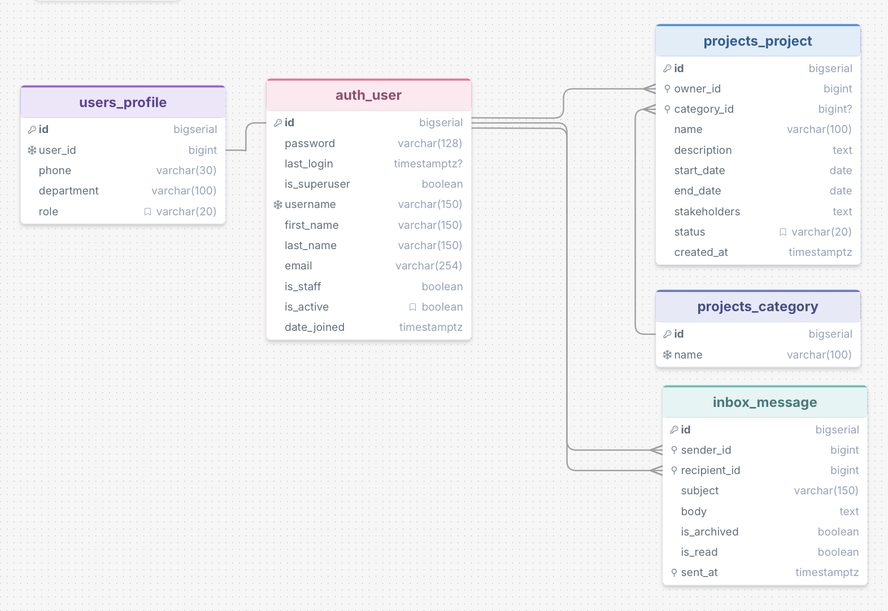

# ProjectPilot
## Project Description
ProjectPilot is a Django-based project management web application designed to help individuals and teams organise projects, maintain project information and communicate through an internal messaging system. 

Users can register an account, maintain a personal profile, create and categorise projects, exchange messages with other users and monitor activity through a central dashboard. 

The project demonstrates core Django ideas including:
- PostgreSQL database integration
- Django models and migrations
- Authentication and password hashing
- Role-based authorization
- Function-based and class-based views
- CRUD operations 
- Django forms and validation
- Template inheritance
- Responsive Bootstrap styling and layout
- JavaScript form behaviour
- Email-based password recovery mechanism
- Automated testing with Django 'TestCase'

## Features

### User registration and authentication
Users can register with a username, email address and password. Passwords are securely hashed using Django's built-in authentication system rather than being stored as plain text. Users can log in and out, while protected views redirect unauthenticated visitors to the login page. 

### Project management function
Users can create, view, edit and delete projects. Each project stores
- Project name
- Description
- Start date
- End date/Deadline
- Status
- Category
- Stakeholders
- Owner
- Creation date 

Form validation prohibits a project deadline from being set before the start date. 

### Project categories
Project categories are stored in a separate 'Category' model and linked to projects through a foreign key. Categories can therefore be managed by an administrator rather than being hard-coded into the application. 

If a category is deleted, its projects remain in the database because the relationship uses `SET_NULL`.

### Internal user messaging 
Registered users can send messages to other app users. The messaging system includes:
- Inbox
- Sent messages 
- Read and unread status
- Message detail view
- Reply and forwarding support
- Message archiving
- Message restoration

The reply function reuses the existing compose-message form. It pre-fills the original sender as the recipient, adds `Re:` to the subject and quotes the original message. The recipient can be changed, allowing the workflow to forward the message. 

Archiving and restoration use POST requests with CSRF protection. Users can only archive or restore messages for which they are the recipient. 

### User profiles
Each user has a linked profile which includes
- Phone number
- Department
- Role in the organization

Users can update their own personal and contact details. Email validation prevents a profile from being changed to an address already used by another account. 

### Roles and permissions
ProjectPilot includes three application roles:
|Role | Project access |
|---|---|
| User | Can access only their own projects |
|Project Manager | Can access and edit all projects |
| Administrator | Can access and edit all projects |

Admins assign roles through the Django admin panel. Managers and admins can view, update and delete projects belonging to other users. Ordinary users remain restricted to their own records. 

### Password reset
ProjectPilot uses Django's built-in password-reset workflow. Users can request a password reset using the email address associated with their account. Reset emails are sent through Gmail SMTP. Email credentials are stored in environment variables and not committed to the Github repo.

### JavaScript features
JavaScript is used to improve interactions without replacing Django's server-side validation. It provides:
- Live character count while writing a message
- Confirmation prompts for important actions
- Support for Bootstrap's responsive navigation

## Database
The application uses PostgreSQL hosted on Neon and accessed through Django's ORM. 
The main models are:
- Django `User`
- `Profile`
- `Project`
- `Category`
- `Message`

## Database schema

## Design and Structure

### Application structure
The project is divided into three Django applications:
- `users` handles registration, profiles and account-related views.
- `projects` handles project records, categories and role-based project access.
- `inbox` handles internal messages, replies, archiving and restoration.

This modular structure keeps the models, forms, views, URLs and tests grouped and feature and allows the application to be extended later. 

### Template structure
The project uses a main `templates` directory with feature-specific subdirectories for users, projects and inbox pages. 

The shared `base.html` template provides the common navigation, messages, footer, stylesheets and scripts. Other templates extend this base so the layout remains consistent without repeating the complete page structure. 

### Responsive interface

Bootstrap is used for the grid system, navigation, cards, forms, buttons, tables and responsive layouts. Wider layouts use columns when needed, while stacking it on smaller screens. Custom styles are stored separately in `static/css/style.css` and JavaScript in `static/js/main.js` 

## Development Process

### Planning the data models

A significant part of the dev. process was deciding the required fields and relationships before building the pages. 

The User, Profile, Project, Category and Messages relationships had to be planned in advance so that forms, views and templates could use a consistent structure. This required more initial planning that in previous assessments which I approached in a more iterative (chaotic) manner. Ultimately, this made the later HTML and template building work more straightforward. 

### Django forms and validation

Django  forms are used to manage registration, profile updates, project records and messages. 

Validation includes:
- Django's built-in password validation
- Required registration email addresses
- Unique email validation during profile updates
- Project deadline validation
- Minimum message-subject length

POST forms include CSRF tokens, and state-changing actions such as deletion, archiving, restoration and logout use POST requests.

### Authorization

Project querysets are filtered according to the authenticated user and their role. Ordinary users receive only their own projects, while project managers and administrators can work across all project records. 

Message detail, archive and restore operations also check that the requesting user is a participant in, or recipient of a relevant message.

## Automated testing

ProjectPilot containts 18 automated tests across it's three application areas. 
- Project model content and string representation
- Project form validation
- Project list and detail views
- Login requirements and project ownership
- Message model content and defaults
- Sending and viewing messages
- Read-status updates
- Message privacy
- User registration form validation
- User and profile creation
- Password hashing
- Profile login protection
- Profile updates

The complete test suite can be run with:
`python manage.py test --keepdb`
At the time of submission, all 18 automated tests pass successfully.

## User roles and features
### Unregistered users
Unregistered users can: 
- Register an account
- Access log in screen
- Request a password reset

### Standard users
Authenticated users with the standard `user` role can:
- Access a personal dashboard
- Create projects
- View, update and delete their own projects
- Send messages to other users
- View inbox and sent messages
- Reply to or forward messages
- Archive and restore received messages
- Update their personal and contact details

### Project managers

Users assigned to the `project manager` role  can:
- Access all standard account and messaging features
- View projects belonging to every user
- Update projects belonging to every user
- Delete projects belonging to every user

### Administrators

Users assigned to the `admin` role can access all projects in the same way as a project manager. Authorized Django admin users can also access the admin panel to manage users, profiles, roles, categories, projects and messages. 

## Routes Overview

### Main and account routes
| Route | Method | Access | Purpose |
|---|---|---|---|
| `/` | GET | Login required | Display the personal dashboard |
| `/admin/` | GET, POST | Django admin | Django administration panel |
| `/users/register/` | GET, POST | Public | Display and process account registration |
| `/users/login/` | GET, POST | Public | Authenticate a user |
| `/users/logout/` | POST | Login required | End the current session |
| `/users/profile/` | GET, POST | Login required | Display and update personal and contact details |
| `/password-reset/` | GET, POST | Public | Request a password-reset email |
| `/password-reset/done/` | GET | Public | Confirm that the reset request was submitted |
| `/password-reset-confirm/<uidb64>/<token>/` | GET, POST | Reset token required | Validate the token and set a new password |
| `/password-reset-complete/` | GET | Public | Confirm that the password was changed |

### Project routes
| Route | Method | Access | Purpose |
|---|---|---|---|
| `/projects/` | GET | Login required | List projects available to the current user |
| `/projects/project/new/` | GET, POST | Login required | Display and process the project creation form |
| `/projects/project/<pk>/` | GET | Login required and authorized | Display one project |
| `/projects/project/<pk>/update/` | GET, POST | Login required and authorized | Display and process the project update form |
| `/projects/project/<pk>/delete/` | GET, POST | Login required and authorized | Display confirmation and delete a project |

### Inbox routes

| Route | Method | Access | Purpose |
|---|---|---|---|
| `/inbox/` | GET | Login required | Display received, non-archived messages |
| `/inbox/compose/` | GET, POST | Login required | Display and process the compose-message form |
| `/inbox/sent/` | GET | Login required | Display messages sent by the current user |
| `/inbox/archived/` | GET | Login required | Display archived received messages |
| `/inbox/<pk>/` | GET | Sender or recipient | Display a message and mark it read for its recipient |
| `/inbox/<pk>/reply/` | GET, POST | Sender or recipient | Reply to or forward a message using the compose form |
| `/inbox/<pk>/archive/` | POST | Recipient only | Archive a received message |
| `/inbox/message/<pk>/unarchive/` | POST | Recipient only | Restore an archived message |

## Technologies Used
- Python
- Django
- PostgreSQL
- Neon
- HTML5
- CSS
- Bootstrap 5
- JavaScript
- Whitenoise
- gunicorn
- Render
- Gmail SMTP
- Brevo Platform

## External Resources Used

The following resources were used to review and verify features that went beyond the main course material.

### Internal Messaging 

The internal messaging system uses two foreign-key relationships to associate each message with a sender and recipient. Django model fields and QuerySets are also used to manage read, unread, archived and restored message states. 

- [Django many-to-one relationships](https://docs.djangoproject.com/en/5.2/topics/db/examples/many_to_one/)

- [Django model field reference](https://docs.djangoproject.com/en/5.2/ref/models/fields/)

- [Django model forms](https://docs.djangoproject.com/en/5.2/topics/forms/modelforms/)

- [Django database queries](https://docs.djangoproject.com/en/5.2/topics/db/queries/)

### Roles and Project Authorization
Django authentication and filtered QuerySets were used to control access to project records. ProjectPilot extends this approach with user, project manager and admin roles. 

- [Django authentication and authorization](https://docs.djangoproject.com/en/5.2/topics/auth/default/)

### Categories and Administration
Project categories are stored in a separate model and connected to projects through a many to one relationship. Categories are created and managed by admin users in the Django admin panel.

- [Django administration](https://docs.djangoproject.com/en/5.2/ref/contrib/admin/)

### Dashboard Queries
The dashboard uses Django QuerySets to filter, count and order project and message records. 

- [Django aggregation](https://docs.djangoproject.com/en/5.2/topics/db/aggregation/)

### Images and media
- ‘PPfavicon.jpg’ generated in ChatGPT

## GitHub Repository
This project source code is available at: 
[ProjectPilot GitHub Repository](https://github.com/ScriptusDigital/Frameworks_Assignment)

## Deployment

ProjectPilot is deployed on Render using the linked GitHub repository and a PostgreSQL database hosted by Neon. Config values are provided through environment variables in the Render dashboard.

### Render Deployment process
1. Push completed project to GitHub
2. Create new webservice on Render and connect the GitHub repo. 
3. Set build command to: 
./build.sh
4. Set start command to: 
gunicorn projectpilot.wsgi
5. Add required environment variable in Render dashboard:
SECRET_KEY
DATABASE_URL
EMAIL_USER
EMAIL_PASS
DEBUG=False
6. Deploy the web service and verify build completed. 
7. Open the application and test its main functionality.

Sensitive values are stored as environment variable and not committed to the GitHub repo. 

## Live deployment site
The application is available at: 
[Live App](https://frameworks-assignment.onrender.com/)

